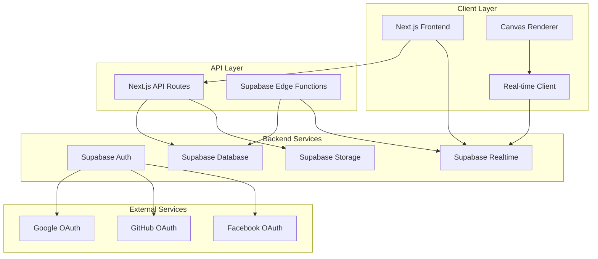
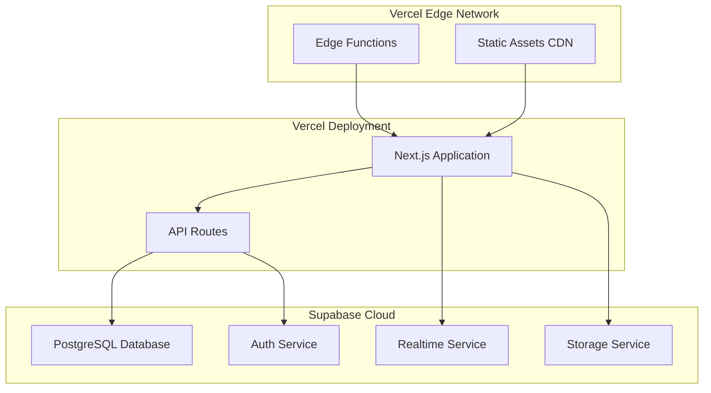

# Design Document

## Overview

Gen Art Pixels is a collaborative pixel art platform built on Next.js 15 with React 19, utilizing Supabase for backend services including authentication, real-time collaboration, and data persistence. The architecture emphasizes horizontal scalability, real-time performance, and responsive user experience across devices.

The platform follows a modern web architecture with server-side rendering for SEO and performance, client-side interactivity for pixel editing, and real-time synchronization for collaborative features.

## Architecture

### High-Level Architecture



### Technology Stack

**Frontend:**
- Next.js 15 with App Router for SSR and routing
- React 19 for UI components and state management
- TypeScript for type safety
- Tailwind CSS for styling
- HTML5 Canvas for pixel rendering
- Supabase JavaScript client for real-time and auth

**Backend:**
- Supabase PostgreSQL for data persistence
- Supabase Auth for SSO authentication
- Supabase Realtime for live collaboration
- Supabase Storage for frame snapshots and backups
- Supabase Edge Functions for complex business logic

**Infrastructure:**
- Vercel for frontend deployment and edge functions
- Supabase cloud for managed backend services
- CDN for static asset delivery

## Components and Interfaces

### Core Components

#### 1. Authentication System
```typescript
interface User {
  id: string;
  handle: string;
  email: string;
  avatar_url?: string;
  pixels_available: number;
  last_refill: timestamp;
  created_at: timestamp;
  updated_at: timestamp;
}

interface AuthProvider {
  signIn(provider: 'google' | 'github' | 'facebook'): Promise<void>;
  signOut(): Promise<void>;
  getCurrentUser(): User | null;
  createHandle(handle: string): Promise<boolean>;
}
```

#### 2. Frame Management System
```typescript
interface Frame {
  id: string;
  handle: string;
  title: string;
  description: string;
  keywords: string[];
  owner_handle: string;
  width: number;
  height: number;
  permissions: 'open' | 'approval-required' | 'owner-only';
  is_frozen: boolean;
  created_at: timestamp;
  updated_at: timestamp;
  stats: FrameStats;
}

interface FrameStats {
  total_pixels: number;
  contributors_count: number;
  likes_count: number;
  last_activity: timestamp;
}

interface FramePermission {
  frame_id: string;
  user_handle: string;
  permission_type: 'contributor' | 'blocked' | 'pending';
  granted_by: string;
  created_at: timestamp;
}
```

#### 3. Pixel System
```typescript
interface Pixel {
  id: string;
  frame_id: string;
  x: number;
  y: number;
  color: number; // ARGB format: 0xAARRGGBB, 0x00000000 for transparent
  contributor_handle: string;
  placed_at: timestamp;
}

interface PixelPlacement {
  frameId: string;
  x: number;
  y: number;
  color: number; // ARGB format
  userHandle: string;
}
```

#### 4. Canvas Renderer
```typescript
interface CanvasRenderer {
  initialize(canvas: HTMLCanvasElement, frame: Frame): void;
  loadFromSnapshot(snapshotData: Uint8Array): void;
  applyRecentPixels(pixels: Pixel[]): void;
  renderPixels(pixels: Pixel[]): void;
  setZoom(level: number): void;
  setPan(x: number, y: number): void;
  showGrid(visible: boolean): void;
  getPixelAtCoordinate(x: number, y: number): {x: number, y: number} | null;
  fitToFrame(): void;
}
```

#### 5. Frame Snapshot System
```typescript
interface FrameSnapshot {
  id: string;
  frameId: string;
  snapshotData: Uint8Array; // Compressed pixel data
  pixelCount: number;
  createdAt: timestamp;
}

interface SnapshotManager {
  createSnapshot(frameId: string): Promise<FrameSnapshot>;
  getLatestSnapshot(frameId: string): Promise<FrameSnapshot | null>;
  compressPixelData(pixels: Pixel[]): Uint8Array;
  decompressPixelData(data: Uint8Array): Pixel[];
}
```

#### 6. Color Utilities
```typescript
interface ColorUtils {
  // Convert hex string to ARGB integer
  hexToArgb(hex: string): number; // "#FF0000" -> 0xFFFF0000
  
  // Convert ARGB integer to hex string
  argbToHex(argb: number): string; // 0xFFFF0000 -> "#FF0000"
  
  // Extract ARGB components
  extractArgb(argb: number): { a: number; r: number; g: number; b: number };
  
  // Create ARGB from components
  createArgb(a: number, r: number, g: number, b: number): number;
  
  // Predefined palette (32 colors)
  PALETTE: readonly number[];
}

const COLOR_PALETTE: readonly number[] = [
  0x00000000, // Transparent
  0xFF6D001A, // Dark Red
  0xFFBE0039, // Red
  0xFFFF4500, // Orange
  0xFFFFA800, // Yellow-Orange
  0xFFFFD635, // Yellow
  0xFF00A368, // Dark Green
  0xFF00CC78, // Green
  0xFF7EED56, // Light Green
  0xFF00756F, // Dark Teal
  0xFF009EAA, // Teal
  0xFF00CCC0, // Light Teal
  0xFF2450A4, // Dark Blue
  0xFF3690EA, // Blue
  0xFF51E9F4, // Light Blue
  0xFF493AC1, // Dark Indigo
  0xFF6A5CFF, // Indigo
  0xFF94B3FF, // Light Indigo
  0xFF811E9F, // Dark Purple
  0xFFB44AC0, // Purple
  0xFFE4ABFF, // Light Purple
  0xFFDE107F, // Dark Pink
  0xFFFF3881, // Pink
  0xFFFF99AA, // Light Pink
  0xFF6D482F, // Brown
  0xFF9C6926, // Tan
  0xFFFFB470, // Light Tan
  0xFF000000, // Black
  0xFF515252, // Dark Gray
  0xFF898D90, // Gray
  0xFFD4D7D9, // Light Gray
  0xFFFFFFFF  // White
] as const;
```

#### 5. Real-time Collaboration
```typescript
type FrameEvent = 
  | { type: 'pixel'; data: Pixel }
  | { type: 'freeze'; frameId: string; isFrozen: boolean }
  | { type: 'updateTitle'; frameId: string; title: string }
  | { type: 'updatePermissions'; frameId: string; permissions: string }
  | { type: 'delete'; frameId: string };

interface RealtimeManager {
  subscribeToFrame(frameId: string, callback: (event: FrameEvent) => void): void;
  unsubscribeFromFrame(frameId: string): void;
  broadcastFrameEvent(event: FrameEvent): void;
  handleConnectionLoss(): void;
  reconnect(): void;
}
```

### API Interfaces

#### Frame API
```typescript
// GET /api/frames - List frames with search and pagination
interface FrameListResponse {
  frames: Frame[];
  total: number;
  page: number;
  limit: number;
}

// POST /api/frames - Create new frame
interface CreateFrameRequest {
  handle: string;
  title: string;
  description: string;
  keywords: string[];
  width: number;
  height: number;
  permissions: 'open' | 'approval-required' | 'owner-only';
}

// GET /api/frames/[userHandle]/[frameHandle] - Get specific frame
interface FrameResponse {
  frame: Frame;
  snapshotData: Uint8Array; // Compressed pixel data
  recentPixels: Pixel[]; // Pixels placed since last snapshot
  userPermission: FramePermission | null; // Only current user's permission
}
```

#### Pixel API
```typescript
// POST /api/pixels - Place pixel
interface PlacePixelRequest {
  frameId: string;
  x: number;
  y: number;
  color: number; // ARGB format
}

interface PlacePixelResponse {
  success: boolean;
  pixel?: Pixel;
  quotaRemaining: number;
  error?: string;
}
```

## Data Models

### Database Schema

#### Users Table
```sql
CREATE TABLE users (
  id UUID PRIMARY KEY DEFAULT gen_random_uuid(),
  handle VARCHAR(20) UNIQUE NOT NULL CHECK (length(handle) >= 5),
  email VARCHAR(255) UNIQUE,
  avatar_url TEXT,
  pixels_available INTEGER DEFAULT 100,
  last_refill TIMESTAMP WITH TIME ZONE DEFAULT NOW(),
  created_at TIMESTAMP WITH TIME ZONE DEFAULT NOW(),
  updated_at TIMESTAMP WITH TIME ZONE DEFAULT NOW()
);

CREATE INDEX idx_users_handle ON users(handle);
CREATE INDEX idx_users_last_refill ON users(last_refill);
```

#### Frames Table
```sql
CREATE TABLE frames (
  id UUID PRIMARY KEY DEFAULT gen_random_uuid(),
  handle VARCHAR(100) NOT NULL CHECK (length(handle) >= 3),
  title VARCHAR(255) NOT NULL,
  description TEXT,
  keywords TEXT[],
  owner_handle VARCHAR(20) NOT NULL REFERENCES users(handle),
  width INTEGER NOT NULL,
  height INTEGER NOT NULL,
  permissions VARCHAR(20) DEFAULT 'open' CHECK (permissions IN ('open', 'approval-required', 'owner-only')),
  is_frozen BOOLEAN DEFAULT FALSE,
  created_at TIMESTAMP WITH TIME ZONE DEFAULT NOW(),
  updated_at TIMESTAMP WITH TIME ZONE DEFAULT NOW()
);

CREATE UNIQUE INDEX idx_frames_owner_handle ON frames(owner_handle, handle);
CREATE INDEX idx_frames_owner ON frames(owner_handle);
CREATE INDEX idx_frames_keywords ON frames USING GIN(keywords);
CREATE INDEX idx_frames_created_at ON frames(created_at DESC);
```

#### Pixels Table
```sql
CREATE TABLE pixels (
  id UUID PRIMARY KEY DEFAULT gen_random_uuid(),
  frame_id UUID NOT NULL REFERENCES frames(id) ON DELETE CASCADE,
  x INTEGER NOT NULL,
  y INTEGER NOT NULL,
  color INTEGER NOT NULL, -- ARGB format: 0xAARRGGBB, 0x00000000 for transparent
  contributor_handle VARCHAR(20) NOT NULL REFERENCES users(handle),
  placed_at TIMESTAMP WITH TIME ZONE DEFAULT NOW(),
  UNIQUE(frame_id, x, y)
);

CREATE INDEX idx_pixels_frame ON pixels(frame_id);
CREATE INDEX idx_pixels_contributor ON pixels(contributor_handle);
CREATE INDEX idx_pixels_placed_at ON pixels(placed_at DESC);
```

#### Frame Permissions Table
```sql
CREATE TABLE frame_permissions (
  id UUID PRIMARY KEY DEFAULT gen_random_uuid(),
  frame_id UUID NOT NULL REFERENCES frames(id) ON DELETE CASCADE,
  user_handle VARCHAR(20) NOT NULL REFERENCES users(handle),
  permission_type VARCHAR(20) NOT NULL CHECK (permission_type IN ('contributor', 'blocked', 'pending')),
  granted_by VARCHAR(20) NOT NULL REFERENCES users(handle),
  created_at TIMESTAMP WITH TIME ZONE DEFAULT NOW(),
  UNIQUE(frame_id, user_handle)
);

CREATE INDEX idx_frame_permissions_frame ON frame_permissions(frame_id);
CREATE INDEX idx_frame_permissions_user ON frame_permissions(user_handle);
```

#### Frame Snapshots Table
```sql
CREATE TABLE frame_snapshots (
  id UUID PRIMARY KEY DEFAULT gen_random_uuid(),
  frame_id UUID NOT NULL REFERENCES frames(id) ON DELETE CASCADE,
  snapshot_data BYTEA NOT NULL, -- Compressed pixel data
  pixel_count INTEGER NOT NULL,
  created_at TIMESTAMP WITH TIME ZONE DEFAULT NOW()
);

CREATE INDEX idx_frame_snapshots_frame_time ON frame_snapshots(frame_id, created_at DESC);
```

#### Frame Stats Counters Table
```sql
CREATE TABLE frame_stats (
  frame_id UUID PRIMARY KEY REFERENCES frames(id) ON DELETE CASCADE,
  contributors_count INTEGER DEFAULT 0,
  total_pixels INTEGER DEFAULT 0,
  likes_count INTEGER DEFAULT 0,
  last_activity TIMESTAMP WITH TIME ZONE DEFAULT NOW(),
  updated_at TIMESTAMP WITH TIME ZONE DEFAULT NOW()
);

CREATE INDEX idx_frame_stats_activity ON frame_stats(last_activity DESC);
```

#### Frame Likes Table
```sql
CREATE TABLE frame_likes (
  id UUID PRIMARY KEY DEFAULT gen_random_uuid(),
  frame_id UUID NOT NULL REFERENCES frames(id) ON DELETE CASCADE,
  user_handle VARCHAR(20) NOT NULL REFERENCES users(handle),
  created_at TIMESTAMP WITH TIME ZONE DEFAULT NOW(),
  UNIQUE(frame_id, user_handle)
);

CREATE INDEX idx_frame_likes_frame ON frame_likes(frame_id);
CREATE INDEX idx_frame_likes_user ON frame_likes(user_handle);
```

#### Stats Update Triggers
```sql
-- Trigger to update stats when pixels are placed
CREATE OR REPLACE FUNCTION update_frame_stats_on_pixel()
RETURNS TRIGGER AS $$
BEGIN
  INSERT INTO frame_stats (frame_id, contributors_count, total_pixels, last_activity)
  VALUES (NEW.frame_id, 1, 1, NEW.placed_at)
  ON CONFLICT (frame_id) DO UPDATE SET
    contributors_count = (
      SELECT COUNT(DISTINCT contributor_handle) 
      FROM pixels 
      WHERE frame_id = NEW.frame_id
    ),
    total_pixels = frame_stats.total_pixels + 1,
    last_activity = NEW.placed_at,
    updated_at = NOW();
  RETURN NEW;
END;
$$ LANGUAGE plpgsql;

CREATE TRIGGER trigger_update_frame_stats_on_pixel
  AFTER INSERT ON pixels
  FOR EACH ROW
  EXECUTE FUNCTION update_frame_stats_on_pixel();

-- Trigger to update stats when likes are added/removed
CREATE OR REPLACE FUNCTION update_frame_stats_on_like()
RETURNS TRIGGER AS $$
BEGIN
  IF TG_OP = 'INSERT' THEN
    UPDATE frame_stats 
    SET likes_count = likes_count + 1, updated_at = NOW()
    WHERE frame_id = NEW.frame_id;
    RETURN NEW;
  ELSIF TG_OP = 'DELETE' THEN
    UPDATE frame_stats 
    SET likes_count = likes_count - 1, updated_at = NOW()
    WHERE frame_id = OLD.frame_id;
    RETURN OLD;
  END IF;
  RETURN NULL;
END;
$$ LANGUAGE plpgsql;

CREATE TRIGGER trigger_update_frame_stats_on_like
  AFTER INSERT OR DELETE ON frame_likes
  FOR EACH ROW
  EXECUTE FUNCTION update_frame_stats_on_like();
```

## Error Handling

### Client-Side Error Handling

#### Network Errors
- Implement exponential backoff for failed API requests
- Show user-friendly error messages for connection issues
- Disable pixel placement when offline to prevent data loss
- Display offline status indicator to users

#### Validation Errors
- Real-time validation for handle creation
- Color palette validation before pixel placement
- Quota validation with clear feedback
- Form validation with immediate feedback

#### Canvas Errors
- Graceful degradation if Canvas API is unavailable
- Error boundaries for React components
- Fallback rendering for unsupported browsers

### Server-Side Error Handling

#### Database Errors
```typescript
class DatabaseError extends Error {
  constructor(message: string, public code: string) {
    super(message);
    this.name = 'DatabaseError';
  }
}

class QuotaExceededError extends Error {
  constructor(public remainingTime: number) {
    super('Pixel quota exceeded');
    this.name = 'QuotaExceededError';
  }
}
```

#### API Error Responses
```typescript
interface APIError {
  error: string;
  code: string;
  details?: any;
  timestamp: string;
}

// Standard error codes
const ERROR_CODES = {
  QUOTA_EXCEEDED: 'QUOTA_EXCEEDED',
  INVALID_HANDLE: 'INVALID_HANDLE',
  FRAME_NOT_FOUND: 'FRAME_NOT_FOUND',
  PERMISSION_DENIED: 'PERMISSION_DENIED',
  INVALID_COORDINATES: 'INVALID_COORDINATES'
} as const;
```

## Testing Strategy

### Unit Testing
- **Components**: Test React components with React Testing Library
- **Utilities**: Test pixel placement logic, quota calculations, and validation functions
- **API Routes**: Test Next.js API routes with mock Supabase client
- **Canvas Logic**: Test rendering and interaction logic with mock Canvas API

### Integration Testing
- **Authentication Flow**: Test SSO integration with Supabase Auth
- **Real-time Features**: Test pixel broadcasting and receiving
- **Database Operations**: Test CRUD operations with test database
- **API Endpoints**: Test complete request/response cycles

### End-to-End Testing
- **User Journeys**: Test complete user flows from registration to pixel placement
- **Cross-browser Testing**: Ensure Canvas compatibility across browsers
- **Mobile Testing**: Test touch interactions and responsive design
- **Performance Testing**: Test with high concurrent user loads

### Performance Testing
- **Load Testing**: Simulate high concurrent pixel placement
- **Real-time Stress Testing**: Test WebSocket connections under load
- **Database Performance**: Test query performance with large datasets
- **Canvas Rendering**: Test rendering performance with large frames

### Testing Tools
```json
{
  "devDependencies": {
    "@testing-library/react": "^14.0.0",
    "@testing-library/jest-dom": "^6.0.0",
    "jest": "^29.0.0",
    "jest-environment-jsdom": "^29.0.0",
    "playwright": "^1.40.0",
    "msw": "^2.0.0"
  }
}
```

## Frame Loading Strategy

### Efficient Frame State Loading

To avoid loading potentially 147k individual pixels for large frames, the system uses a snapshot-based approach:

#### Snapshot System
1. **Frame Snapshots**: Periodic compressed snapshots of complete frame state
2. **Incremental Updates**: Only recent pixels since last snapshot are loaded individually
3. **Compression**: Pixel data is compressed using efficient algorithms (RLE + gzip)
4. **Background Generation**: Snapshots are generated asynchronously when frames reach certain thresholds

#### Loading Process
```typescript
async function loadFrame(userHandle: string, frameHandle: string): Promise<FrameState> {
  // 1. Load frame metadata
  const frame = await getFrameMetadata(userHandle, frameHandle);
  
  // 2. Load latest snapshot (ordered by created_at DESC)
  const snapshot = await getLatestSnapshot(frame.id);
  
  // 3. Load recent pixels since snapshot
  const recentPixels = await getPixelsSince(frame.id, snapshot.createdAt);
  
  // 4. Decompress and merge data
  const basePixels = decompressPixelData(snapshot.snapshotData);
  const currentState = mergePixelUpdates(basePixels, recentPixels);
  
  return { frame, pixels: currentState };
}

async function getLatestSnapshot(frameId: string): Promise<FrameSnapshot> {
  return await db
    .from('frame_snapshots')
    .select('*')
    .eq('frame_id', frameId)
    .order('created_at', { ascending: false })
    .limit(1)
    .single();
}
```

#### Snapshot Triggers
- **Pixel Count**: Create snapshot every 1000 pixels placed
- **Time-based**: Create snapshot every 24 hours for active frames
- **Manual**: Frame owners can trigger snapshot creation
- **Performance**: Create snapshot when recent pixels exceed 500

#### Compression Strategy
```typescript
interface PixelCompression {
  // Run-length encoding for sparse pixel data
  rleCompress(pixels: Pixel[]): Uint8Array;
  
  // Additional gzip compression
  gzipCompress(data: Uint8Array): Uint8Array;
  
  // Combined compression achieving ~90% reduction for typical frames
  compressFrame(pixels: Pixel[]): Uint8Array;
}
```

## Scalability Considerations

### Horizontal Scaling

#### Database Scaling
- **Read Replicas**: Use Supabase read replicas for frame browsing and stats
- **Connection Pooling**: Implement connection pooling for high concurrency
- **Query Optimization**: Use proper indexing and query optimization
- **Partitioning**: Partition pixels table by frame_id for large datasets

#### Real-time Scaling
- **Channel Isolation**: Separate real-time channels per frame
- **Connection Management**: Implement connection limits per frame
- **Message Batching**: Batch pixel updates for high-frequency changes
- **Geographic Distribution**: Use Supabase edge locations for global users

#### Caching Strategy
```typescript
interface CacheStrategy {
  // Frame metadata caching
  frameCache: {
    ttl: 300; // 5 minutes
    keys: ['frame:metadata:{frameId}'];
  };
  
  // Pixel data caching
  pixelCache: {
    ttl: 60; // 1 minute
    keys: ['frame:pixels:{frameId}'];
  };
  
  // User quota caching
  quotaCache: {
    ttl: 3600; // 1 hour
    keys: ['user:quota:{userHandle}'];
  };
}
```

### Performance Optimization

#### Frontend Optimization
- **Canvas Virtualization**: Only render visible pixels during zoom
- **Debounced Updates**: Debounce real-time pixel updates
- **Lazy Loading**: Lazy load frame data and images
- **Code Splitting**: Split code by routes and features

#### Backend Optimization
- **Database Indexing**: Optimize queries with proper indexes
- **Batch Operations**: Batch pixel placements for better performance
- **Background Jobs**: Use background jobs for stats calculation
- **CDN Integration**: Serve static assets through CDN

## Security Considerations

### Authentication Security
- **SSO Integration**: Secure OAuth flows with Supabase Auth
- **Session Management**: Secure session handling with HTTP-only cookies
- **Handle Validation**: Prevent malicious handle creation
- **Rate Limiting**: Implement rate limiting on authentication endpoints

### Data Security
- **Input Validation**: Validate all user inputs on client and server
- **SQL Injection Prevention**: Use parameterized queries
- **XSS Prevention**: Sanitize user-generated content
- **CSRF Protection**: Implement CSRF tokens for state-changing operations

### Real-time Security
- **Channel Authorization**: Verify user permissions for real-time channels
- **Message Validation**: Validate all real-time messages
- **Connection Limits**: Limit concurrent connections per user
- **Abuse Prevention**: Implement pixel placement rate limiting

## Deployment Architecture

### Production Environment


### Environment Configuration
```typescript
interface EnvironmentConfig {
  supabase: {
    url: string;
    anonKey: string;
    serviceRoleKey: string;
  };
  
  app: {
    baseUrl: string;
    environment: 'development' | 'staging' | 'production';
  };
  
  features: {
    maxPixelsPerHour: number;
    maxFrameSize: number;
    enableRealtime: boolean;
  };
}
```

This design provides a robust, scalable foundation for the Gen Art Pixels platform, leveraging modern web technologies and cloud services to deliver a seamless collaborative pixel art experience.